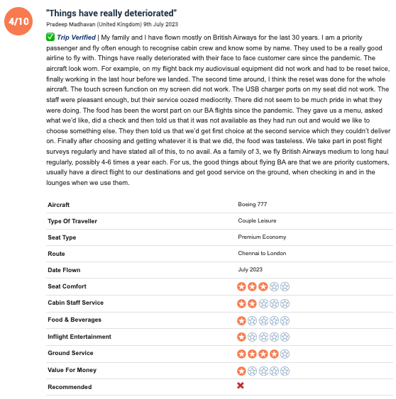

## Contexto e objetivo
Na era atual, em que os consumidores se tornaram cada vez mais críticos e exigentes na decisão de compra, é fundamental que as empresas adotem uma abordagem centrada no cliente para se manterem competitivas no mercado. Sendo assim, é essencial ouvir o que os clientes valorizam e sentem em relação à empresa, coletando dados relevantes que direcionem ações e melhorias internas, a fim de aprimorar a experiência do cliente e aumentar o valor percebido da marca.

Este projeto é um desafio proposto pela companhia aérea British Airways, com o objetivo de extrair informações relevantes de comentários e avaliações de clientes em um site público. Utilizando técnicas de Web Scraping, coletei e estruturei os feedbacks dos clientes que utilizaram os serviços da empresa para formato tabular.

Essa abordagem permite uma análise aprofundada dos comentários dos clientes, fornecendo insights relevantes sobre a percepção geral dos serviços prestados pela empresa. Os dados podem ser explorados de maneira flexível, permitindo a aplicação de técnicas analíticas avançadas como análise de sentimento e a criação de visualizações interativas para uma melhor compreensão dos resultados.

O site no qual os dados estão disponíveis pode ser acessado pelo seguinte [link](https://www.airlinequality.com/)

## Definição de método e observações

### Exemplo de estrutura do comentário no site


### Lógica de desenvolvimento

Cada comentário possui um ID representado por `anchor######` na página HTML, e os dados são coletados seguindo um formato estruturado.

1. **Informações básicas**: inclui o score geral, data do comentário, texto resumo destacado e o comentário completo feito pelo cliente.

2. **Informações analíticas**: atributos específicos, como modelo da aeronave, tipo de viajante, classe de viagem e data do voo. Avaliações de atributos, como conforto do assento, serviço de bordo, comidas e bebidas, entretenimento de voo, serviço de solo e custo-benefício e, por fim, uma marcação dizendo se o cliente recomendaria a companhia ou não. 

Essas informações são coletadas por meio de funções separadas para cada página e, posteriormente, compiladas em um formato tabular. Os dados podem ser analisados tanto no ambiente Python quanto exportados para o Excel para serem tratados e visualizados usando ferramentas como o Power BI para criar visuais analíticos.

## Desenvolvimento

[notebook para execução](https://github.com/saulolvieira/project_1_ws_ba/blob/main/ba_data_input_pipeline.ipynb)

Importação de bibliotecas

``````python
import pandas as pd
import requests
from bs4 import BeautifulSoup
``````

Definição de funções para captura dos dados

``````python
# Função para buscar as informações básicas de cada comentário ( nota, comentário e data)
def get_basic(url):
  response = requests.get(url)
  soup = BeautifulSoup(response.content, 'html.parser')
  comments = soup.find_all('article', attrs={'itemprop': 'review'})

  # Buscando informações básicas
  data_basic = []
  for comment in comments:
      row = {}
      row['review_id'] = comment.find('div', class_='body')['id']
      row['date'] = comment.find('meta')['content']
      score_elem = comment.find('span', attrs={'itemprop': 'ratingValue'})
      if score_elem:
        row['score'] = score_elem.text
      else:
        row['score'] = 0
      row['resume'] = comment.find('h2', class_='text_header').text
      row['review'] = comment.find('div', class_='text_content').text
      data_basic.append(row)

  df_basic = pd.DataFrame(data_basic)
  return df_basic
``````

``````python
# Função para buscar todas as informações analíticas de cada comentário de cada página (tabela depois do comentário)

def get_analytical(url):
  response = requests.get(url)
  soup = BeautifulSoup(response.content, 'html.parser')
  comments = soup.find_all('article', attrs={'itemprop': 'review'})

  # Buscando informações básicas


  # Encontrando todos os ids

  id_ = []
  for comment in comments:
    row = {}
    row['id'] = comment.find('div', class_='body')['id']
    id_.append(row)

  df_id = pd.DataFrame(id_)


  # Encontrar todos os parâmetros de todos os id's do dataframe:

  df_results = pd.DataFrame()

  for i in df_id['id']:
    # Conteúdo da página para cada id
    div = soup.find('div', {'class': 'body', 'id': i})
    div = BeautifulSoup(str(div), 'html.parser')

    # Listas vazias para adicionar os valores de cada coluna
    titles = []
    values = []
    review_id = i

    # encontre todas as tags <tr> de cada elemento da tabela
    rows = [element.find_all('tr') for element in div]
    # desempacote a lista de listas em uma única lista
    rows = [tr for sublist in rows for tr in sublist]

  # extrair títulos e valores da tabela
    for row in rows:
        title_element = row.find('td', {'class': 'review-rating-header'})
        value_element = row.find('td', {'class': 'review-value'})

        if title_element is not None and value_element is not None:
            title = title_element.text.strip()
            value = value_element.text.strip()
            titles.append(title)
            values.append(value)

        # caso exista a classe review-rating-stars, também é possível coletar as informações
        rating_stars = row.find('td', {'class': 'review-rating-stars'})
        if rating_stars is not None:
            title = title_element.text.strip()
            star_spans = rating_stars.find_all('span', {'class': 'star'})
            star_fill_spans = [span for span in star_spans if 'fill' in span['class']]
            value = str(len(star_fill_spans))
            titles.append(title)
            values.append(value)

    # criar um dicionário com as listas de títulos e valores
    data = {'review_id': review_id, 'titles': titles, 'values': values}
    df = pd.DataFrame(data)
    df_results = pd.concat([df_results, df])

  df_analytical = df_results.pivot(index='review_id', columns='titles', values='values')

  return df_analytical
``````
Loop para iteração e busca de dados em todas as páginas disponíveis

``````python
#Buscando as infomações analíticas de todos os comentários da página
num_pages = 36
all_results = []
# loop para chamar a função para cada página
for i in range(1, num_pages+1):
    url = f"https://www.airlinequality.com/airline-reviews/british-airways/page/{i}/?sortby=post_date%3ADesc&pagesize=100"
    scraps = get_analytical(url)
    all_results.append(scraps)
# concatena todos os dataframes em um único dataframe
df = pd.concat(all_results)
df = df.reset_index()
``````

``````python
#Buscando as infomações básicas de todos os comentários da página
num_pages = 36
all_results2 = []
# loop para chamar a função para cada página
for i in range(1, num_pages+1):
    url2 = f"https://www.airlinequality.com/airline-reviews/british-airways/page/{i}/?sortby=post_date%3ADesc&pagesize=100"
    scraps2 = get_basic(url2)
    all_results2.append(scraps2)
# concatena todos os dataframes em um único dataframe
df2 = pd.concat(all_results2)
df2 = df2.reset_index()
``````
Concatenação dos dataframes gerados para formato tabular e analisável 

``````python
df_final = pd.merge(df2, df, on = 'review_id', how = 'inner')
# Exportando para excel:
df_final.to_excel('caminho/para/o/arquivo.xlsx', index=False)
``````
